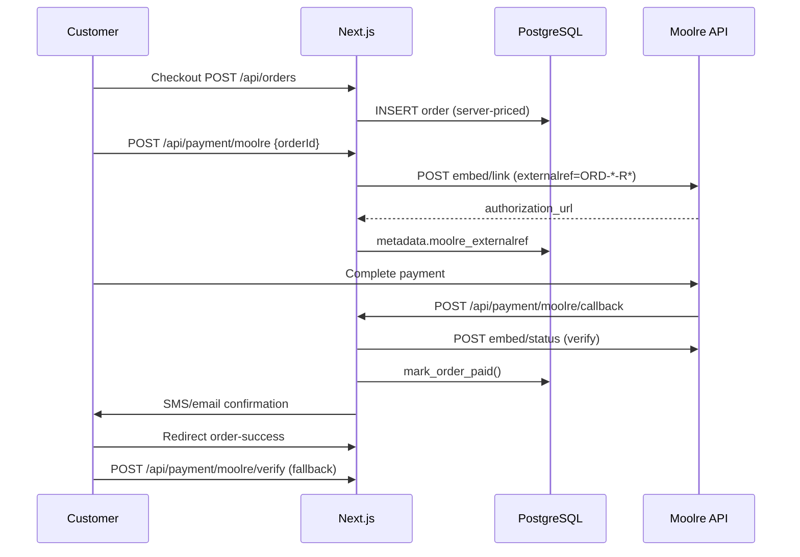

# Payment and Callback Audit — Mamator

**Gateways in codebase:** Moolre only  
**Hubtel / Paystack:** Not implemented (no routes, env vars, or SDK references)

---

## Moolre payment flow

---

## Endpoints

| Route | Method | Purpose | Auth |
|-------|--------|---------|------|
| `/api/payment/moolre` | POST | Create payment link | Rate limit |
| `/api/payment/moolre/callback` | POST | Gateway webhook | Callback secret (prod) |
| `/api/payment/moolre/callback` | GET | Health check | Public |
| `/api/payment/moolre/verify` | POST | Server-side verify fallback | Rate limit |

**Middleware:** Does not block callback (matcher is `/admin` and `/api` headers only — no auth redirect on API).

---

## Environment variables

| Variable | Required | Notes |
|----------|----------|-------|
| `MOOLRE_API_USER` | Yes | Link + verify |
| `MOOLRE_API_PUBKEY` | Yes | Link + verify |
| `MOOLRE_ACCOUNT_NUMBER` | Yes | Link creation |
| `MOOLRE_MERCHANT_EMAIL` | Yes | Payload email |
| `MOOLRE_CALLBACK_SECRET` | **Yes in production** | Body `secret` field |
| `NEXT_PUBLIC_APP_URL` | Yes | Callback/redirect URLs |

---

## Initiation (`POST /api/payment/moolre`)

- Loads order from DB by UUID or order number.
- Rejects already-paid orders.
- Amount from **`order.total`** (server-side) — not client-supplied.
- Generates unique `externalref`: `{order_number}-R{timestamp}`.
- Stores `moolre_externalref` in order metadata on success.
- Redirect URL: `/order-success?order={ref}&payment_success=true`.

**Status:** Working; hardened to persist externalref.

---

## Callback (`POST /api/payment/moolre/callback`)

| Check | Implementation |
|-------|----------------|
| Secret validation | `validateCallbackSecret()` — fails closed in production |
| Rate limiting | `RATE_LIMITS.callback` |
| Body parsing | JSON, form, urlencoded |
| Reference extraction | `extractOrderRefFromCallback()` — strips `-R*` suffix |
| Success detection | `callbackIndicatesSuccess()` |
| Amount validation | Moolre status API + 0.01 tolerance |
| Idempotency | Skip if already paid; `mark_order_paid()` idempotent |
| Failed callback | Does not overwrite paid status |
| Confirmation dedupe | `metadata.confirmation_sent_at` |
| Stock reduction | Inside `mark_order_paid()` with `stock_reduced` flag |

**Response:** JSON `{ success, message }` — fast acknowledgment.

---

## Verification (`POST /api/payment/moolre/verify`)

- Used when customer lands on order-success before callback completes.
- Validates order number format `ORD-\d+-\d+`.
- Uses stored `moolre_externalref` via `resolveMoolreExternalRefForOrder()`.
- Calls Moolre status API — **does not trust browser redirect**.
- Same idempotent mark + confirmation dedupe as callback.

---

## Status normalization

Internal statuses (Postgres enum `payment_status`):

- `pending`
- `paid`
- `failed`
- (others per schema)

Moolre → internal mapping in `lib/payment/moolre.ts`:

| Moolre status | Internal |
|---------------|----------|
| success / successful / completed / paid | verified = true |
| other | verified = false → order stays pending or marked failed on explicit failure callback |

---

## Duplicate protection

1. Unique `externalref` per payment attempt (`-R{timestamp}`).
2. `mark_order_paid()` returns existing row if already paid.
3. Failed callbacks use `WHERE payment_status <> 'paid'`.
4. `confirmation_sent_at` prevents duplicate SMS/email.

---

## Amount integrity

| Rule | Enforced |
|------|----------|
| Order total computed server-side at checkout | Yes |
| Payment link amount from DB | Yes |
| Callback amount vs order total | Yes (via API verify) |
| Client cannot set arbitrary amount | Yes |

---

## Hubtel

**Status:** Not implemented.  
No code paths, env vars, or callbacks exist. Add adapter + routes if required.

---

## Paystack

**Status:** Not implemented.  
No code paths, env vars, or webhooks exist. Add adapter + routes if required.

---

## Reconciliation

**Current:** Manual via admin orders + Moolre dashboard.  
**Recommended:** Admin script to list pending payments > 15 min and call verify endpoint (cron partially implements reminders via `/api/cron/payment-reminders`).

**Cron auth:** Requires `Authorization: Bearer {CRON_SECRET}` in production.

---

## Test results

| Scenario | Status |
|----------|--------|
| Callback GET health | Pass (live 2026-07-29) |
| Callback secret missing in prod | Returns 503 (after deploy) |
| Invalid secret | 403 (after deploy) |
| Live payment (sandbox) | Requires manual test with Moolre test credentials |
| Duplicate callback | Idempotent after migration 002 |
| Verify fallback | Code complete; pending deploy |

---

## Manual actions

1. Register callback URL: `https://mamator.com/api/payment/moolre/callback`
2. Set `MOOLRE_CALLBACK_SECRET` in Moolre dashboard and Coolify env
3. Deploy hardened payment code
4. Run one test transaction in Moolre sandbox
5. Set `CRON_SECRET` for payment reminder cron
